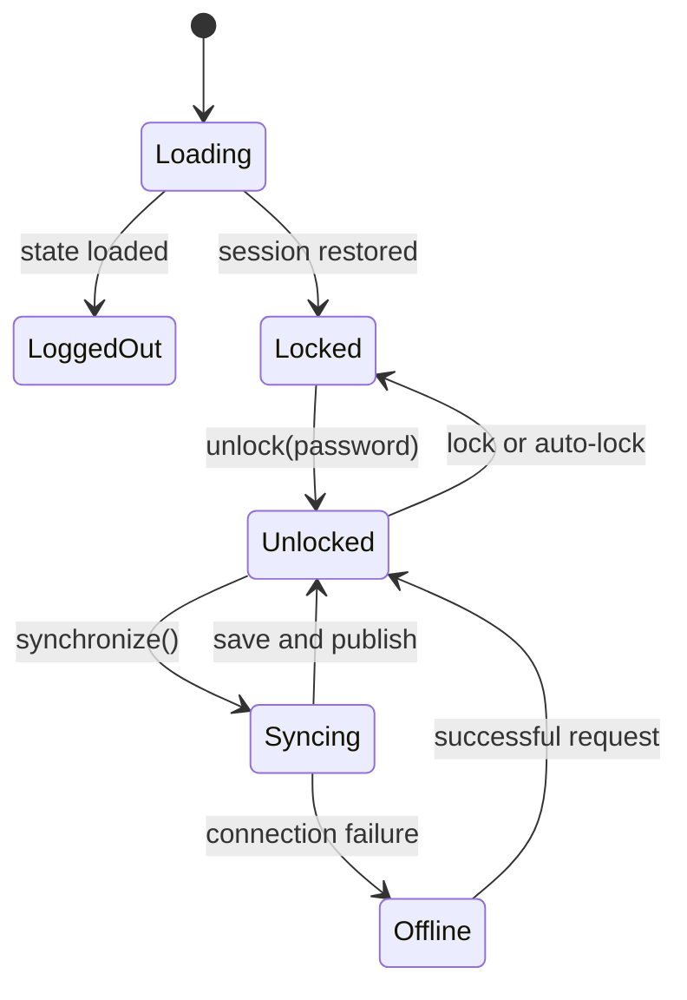

# Core Application Lifecycle

`packages/core/src/app.ts` owns `App`, `AppState`, persistence, account/org/vault state, synchronization, and publication to UI subscribers. `App.load()` reads the `app-state` record, merges device metadata, loads locale, creates a device ID when absent, saves normalized state, and resolves `loaded`. `save()` rebuilds the encrypted host index while unlocked. `reload()` restores state and can re-unlock with the held master key.

`unlock()` requires a logged-in account; `lock()` removes sensitive keys from account, organizations, and vaults while retaining locked serialized state. `synchronize()` fetches auth, account, organizations, invites, and vaults, then saves and records `lastSync`. UI mixins wait on `app.loaded`; auto-lock postpones locking during active synchronization.

Caption: `App.loaded` is the readiness barrier; lock state is separate from session presence.

Persistence uses the platform `Storage` contract. The browser implementation in `packages/app/src/lib/storage.ts` serializes keys as `${kind}_${id}` through `localforage`; changing kind or ID breaks discoverability. Focused evidence includes `cypress/e2e/01 - signup-login.cy.ts`, `cypress/support/commands.ts`, and the currently disabled intended core app spec in `packages/core/src/spec/app.ts`.
