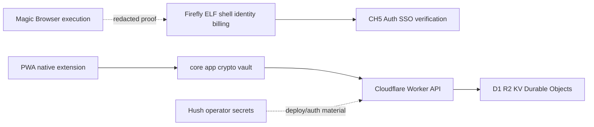

# Repository Boundary

CH5 Auth is a CH5-maintained fork of Padloc. It owns encrypted vault data, the Cloudflare API, client security behavior, deployment, and release cadence. Firefly/ELF owns the shared product shell, identity, billing, and agent runtime. Magic Browser owns browser execution and redacted proof. Hush stores operator and deployment secrets, never user vault records.

The repository packages shared behavior in `packages/core`, UI components in `packages/app`, translations in `packages/locale`, the Worker in `packages/worker`, the PWA in `packages/pwa`, and additional Admin, extension, Cordova, Electron, Tauri, and legacy Node-server surfaces. See [runtime architecture](runtime-architecture.md) for composition and [sharp edges](../operations/sharp-edges.md) before editing.

Caption: CH5 Auth shares product workflows with neighbors while retaining the encrypted-data and deployment boundary.

Maintenance mode means security fixes, dependency/runtime upkeep, upstream compatibility, and regression-proof maintenance continue; broad new product development belongs in the appropriate federated application.
