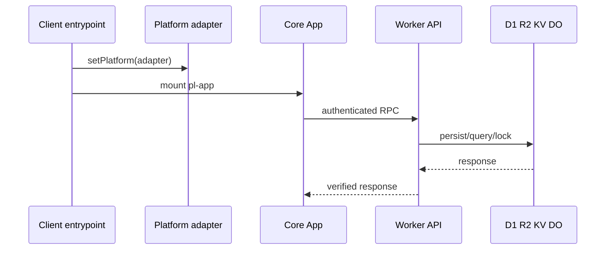

# Runtime Architecture

The root package graph is layered: `@elf-vault/pwa` depends on `@elf-vault/app` and `@elf-vault/core`; `@elf-vault/app` depends on core and locale; `@elf-vault/worker` depends on core and locale; and `@elf-vault/extension` has its own MV3 build and protocol dependencies. Client entrypoints install a platform adapter before importing `@elf-vault/app`: `packages/pwa/src/index.ts`, `packages/cordova/src/index.ts`, `packages/electron/src/index.ts`, `packages/tauri/src/index.ts`, and `packages/admin/src/index.ts`. `packages/core/src/platform.ts` defines storage, crypto, device, clipboard, file, authentication, and authenticator contracts. `packages/app/src/globals.ts` creates the `App` singleton and `AjaxSender`; the PWA bakes `PL_SERVER_URL` into its bundle.

`WebPlatform` in `packages/app/src/lib/platform.ts` is DOM/browser code; `WorkerPlatform` in `packages/worker/src/platform.ts` is Worker-safe; `ExtensionPlatform` adds extension storage/OAuth/WebAuthn; and `ExtensionWorkerPlatform` is the DOM-free MV3 background-worker adapter. A shared authentication capability belongs in core contracts and API types first, then receives explicit adapters in each runtime; never import app DOM elements into Worker or MV3 code. The browser-only boundary is `packages/app/src` and browser platform adapters; the Worker-safe boundary is `packages/worker/src` plus DOM-free core modules; the extension-only boundary is `packages/extension/src` background/content/bridge code; Node-only integrations are under `packages/server/src` and its filesystem/database/HTTP adapters. Node and npm are enforced at Node 24 and npm 11 by `.nvmrc` and package engines. Extension builds inject `PL_SERVER_URL` and run source/dist preflights through `scripts/build-web-extension.cjs`.

The Worker entrypoint is `packages/worker/src/index.ts`; it adapts HTTP to the core `Server` and binds D1, R2, KV, and `AccountLockDO`. Wrangler environments are declared in `packages/worker/wrangler.toml` and target values in `config/environment-targets.json`.

Caption: All clients share core contracts but supply platform-specific storage, crypto, and device behavior.

Important ordering: platform setup precedes UI import; `App.loaded` gates routing and background sync; `clientUrl` is the app host, not the API host; and missing Worker bindings may install throwing stubs rather than fail construction. See [core lifecycle](core-lifecycle.md), [Worker composition](worker-composition.md), and [configuration](../operations/configuration-and-secrets.md).
