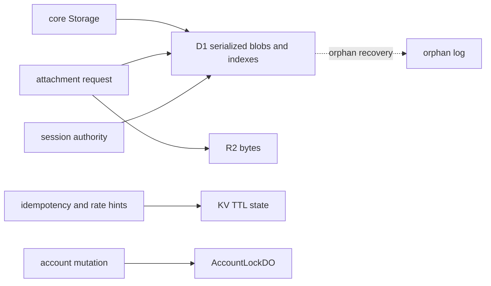

# Worker Storage and Lifecycle

`packages/worker/src/storage/d1.ts` implements core `Storage` as serialized object data plus denormalized query columns. `schema.ts` and ordered migrations `0000_init.sql`, `0001_orphan_log.sql`, and `0002_org_seat_allocations.sql` define the database contract. Writes use explicit upserts and batch operations; migrations are forward-only and applied with the package migration commands.

`R2AttachmentStorage` coordinates D1 metadata and R2 bytes: upload validates size and hash, writes metadata and bytes, retries compensating metadata rollback, and records orphan state when cleanup fails. Reads verify SHA-256; deletes can leave recoverable orphan records because D1 and R2 cannot share a transaction. `HINTS` provides TTL-backed idempotency/rate-limit hints and is not authoritative for sessions. `AccountLockDO` serializes account/org mutation, uses a hold TTL, sorts multi-lock IDs to avoid deadlocks, and releases in reverse order.

Caption: D1 is authoritative for sessions and metadata; R2, KV, and DO provide separate lifecycle capabilities.

Run `npm run worker:migrate:local` before remote migration, then targeted attachment, rate-limit, session, and migration proof lanes. Known schema/migration discrepancies should be verified before relying on undocumented spillover or orphan mappings.
