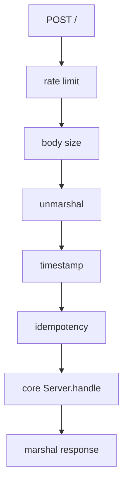

# Worker HTTP Transport

`packages/worker/src/transport.ts` implements `WorkerReceiver` and `WorkerSender`. Normal core RPC is `POST /`; `OPTIONS` returns CORS headers, `GET /metrics` renders Prometheus text, and unknown methods return `405`. The outer handler intercepts `/healthcheck` and special integration routes.

For POST requests, the receiver identifies the client, applies KV-backed rate limiting, enforces a default 25 MiB body limit, unmarshals the core request, copies the IP, validates a five-minute timestamp window plus 30 seconds skew, hashes the exact body, and replays idempotent results for up to one hour. It delegates to `Server.handle`, sanitizes errors, marshals the response, and stores replay metadata.

Caption: The transport validates freshness and replay safety before invoking domain code.

`WorkerSender` treats non-2xx responses as `FAILED_CONNECTION`; authenticated responses are verified by core `Client`. Focused checks: `run-transport-roundtrip.mjs`, `run-error-semantics.mjs`, logging redaction, and metrics runners.
